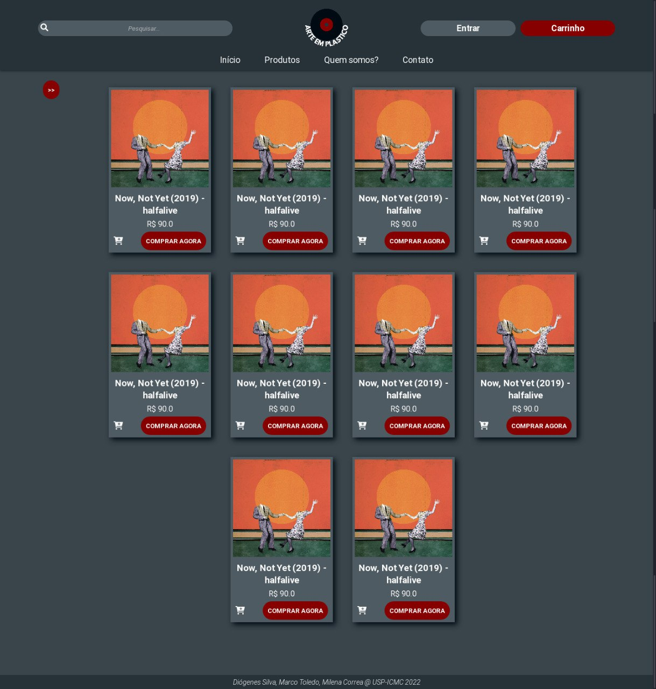

# Arte Em Plástico


## Participantes
<a href="https://github.com/DioPedro"></a>
<a href="https://github.com/Ocramoi"></a>
<a href="https://github.com/milenacsilva"></a>

Diógenes Silva Pedro - **11883476**\
Marco Antônio Ribeiro de Toledo - **11796419**\
Milena Corrêa da Silva - **11795401**

## Projeto no Figma

### [Protótipo com Navegação](https://www.figma.com/proto/RAqfw8Wfo1lq22mlEtHWMf/Trabalho-Web?node-id=0%3A1&scaling=scale-down&page-id=0%3A1&starting-point-node-id=57%3A428&show-proto-sidebar=1)

### [MockUp das Páginas](https://www.figma.com/file/RAqfw8Wfo1lq22mlEtHWMf/Trabalho-Web?node-id=0%3A1)


## Requisitos do sistema

### Descrição Geral 
* O sistema trabalha com a venda de discos de vinis importados e nacionais.
* O sistema possui dois tipos de usuários: Clientes e Admnistradores. 
    * Os admnistradores são aqueles responsáveis por gerenciar clientes, produtos e outros admnistradores.
    * Os clientes são as pessoas que compraram os discos.
    * A aplicação já vem com uma conta padrão de admnistrador com ``` login: admin; senha: admin```.
* O sistema utiliza a lógica tradicional de "carrinhos" para realizar as vendas.
    * O usuário logado pode adicionar/remover itens do carrinho.
    * A compra pode ser concluída após o cliente confirmar/adicionar o endereço de entrega e o método de pagamento (cartão, boleto ou pix).
    * O carrinho é esvaziado quando uma compra é concluída.

### Registros de Dados
* **Admnistradores**: id, nome, telefone e um cadastro (email e senha). 
* **Clientes**: id, nome, telefone, um cadastro (email e senha), uma lista de endereços de entrega (inicialmente vazia), uma lista de cartões (inicialmente vazia) e uma lista de pedidos (inicialmente vazia).
* **Produtos (Discos de Vinil)**: id, título, capa, descrição (curta e detalhada), data de lançamento, artistas, gêneros, informações adicionais sobre o disco físico, preço, quantidade em estoque e quantidade vendida.
* **Cupons**: id, id do usuário, id do disco, porcentagem do desconto.

### Funcionalidade Extra 
* Uma vez por dia, o usuário tem direito a um cupom de desconto em um albúm aleatório, encorajando-o a expandir seu gosto musical.

### Requisitos Não Funcionais
*  O sistema deve ser responsivo e possuir boa usabilidade.

## Descrição do projeto

### Funcionalidades do sistema
* Os administradores podem catalogar/gerenciar os produtos e usuários do sistema de maneira fácil e prática.
* Tanto clientes como visitantes (usuários não cadastrados) podem visualizar a listagem de produtos do site, pesquisar produtos e utilizar filtros.
* Visitantes podem se cadastrar no site, tornando-se clientes.
* A cada dia, clientes tem direito a ganhar desconto em algum disco aleatório.
* Clientes podem acessar e editar sua conta e informações nela contidas, como endereços e dados de cadastro.
* Clientes podem adicionar/remover itens ao carrinho de compras, adicionar/confirmar o endereço de entrega e o metódo de pagamento e, por fim, concluir o pedido.
* Clientes podem acompanhar seu histórico de pedidos.
* A página de cada disco possui uma uma secção que sugere itens similares.

### Informações a serem salvas no servidor
* Os registros de dados dos clientes, administradores, produtos e cupons.

### Estética
Para garantir uma boa experiência de usuário, tentamos utilizar os princípios definidos pelo [Material](https://material.io/design/introduction#principles).

##### Paleta de Cores


### Diagrama de Navegação
Para uma melhor expêriencia de usuário, decidimos separar as páginas de administrador das demais. Assim, o admin consegue acessa-las pelo link `localhost:8080/admin` sem ter âncora com as páginas principais, ou seja, sem que essa página apareça para usuários comuns (visitantes e clientes). 

#### /home


#### /admin

 

## Telas 
### Início


### Listagem de Produtos



### Carrinho


## Testes Automatizados

### Resultados


## Build

## Problemas

## Comentários

